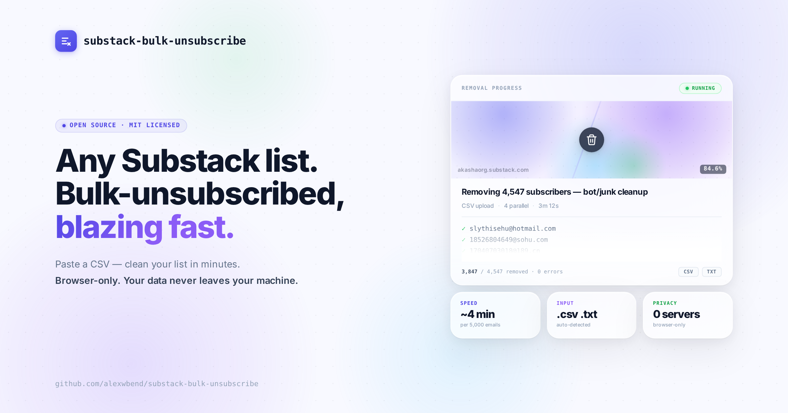

# Substack Bulk Subscriber Remover



Substack doesn't have a built-in way to bulk-unsubscribe a list of emails. If you've migrated from another platform (MailChimp, ConvertKit, etc.) and inherited a polluted list with bots or stale subscribers, your only native option is to click "Remove from list" on each subscriber one at a time. For a list with thousands of removals, that's not realistic.

This is a small browser-console script that does it in minutes instead of hours, by calling the same API endpoint the Substack admin UI uses under the hood.

## What it does

Takes a CSV or TXT file containing email addresses, and removes each of those subscribers from your Substack publication.

## Usage

1. Open your publication's subscriber admin page while signed in:
   `https://YOUR_PUBLICATION.substack.com/publish/subscribers`
2. Open DevTools (Cmd+Option+I on Mac, Ctrl+Shift+I on Windows/Linux) and switch to the **Console** tab.
3. Open [`substack-bulk-remove.js`](./substack-bulk-remove.js), copy the entire file contents.
4. Paste into the console and press Enter. A small panel appears in the top-right.
5. Click **Choose file** and pick your CSV or TXT of emails to remove.
6. Confirm the preview shows the right count, then click **Start removal**.
7. The progress counter ticks through. Most lists finish in well under 15 minutes.

## Input file format

The script auto-detects two formats:

**Plain text** — one email per line:

```
alice@example.com
bob@example.com
carol@example.com
```

**CSV with an `email` column** — header row required, any other columns are ignored:

```
email,name,signup_date
alice@example.com,Alice,2024-01-15
bob@example.com,Bob,2024-02-03
```

The column header `email` is case-insensitive. Invalid-looking lines are skipped silently, and duplicates are deduped automatically.

See [`examples/emails.csv`](./examples/emails.csv) for a working sample file.

## Resume / stop

- Progress is saved in `localStorage` after every 25 removals. If you close the tab or refresh, re-paste the script and re-upload the same file to resume from where you left off.
- To stop mid-run: click the red **Stop** button in the panel, or run `window.__STOP_REMOVER = true` in the console.

## Errors

If any removals fail, the panel will show the error count when finished. Run this in the console to copy the error list to your clipboard:

```js
copy(JSON.stringify(JSON.parse(localStorage.getItem('substack_bulk_remover_progress')).errors, null, 2))
```

Common errors and what they mean:

| Error              | Meaning                                                 |
| ------------------ | ------------------------------------------------------- |
| `http_401`, `http_403` | You're not signed in as the publication owner, or your session expired. Reload the page, sign in again, and rerun. |
| `http_429`         | Substack briefly rate-limited the script. It auto-retries with backoff; if you see lots of these, lower `CONCURRENCY` at the top of the script. |
| `fetch_error:*`    | Network blip. Auto-retries; remaining failures land here. |

## Caveats and safety

- **This calls an internal Substack API endpoint.** It works as of this writing, but Substack could change or restrict the endpoint at any time without notice. If a future release breaks, open an issue.
- **Removals are irreversible.** Removed subscribers would have to opt back in themselves. Always test with a small file (5–10 emails) before running on thousands.
- **Don't run multiple instances at once** against the same publication — you'll just rate-limit yourself.
- This is **not affiliated with or endorsed by Substack**.

## How it works

Substack's admin UI internally calls `DELETE /api/v1/subscriber/<email>` to remove a subscriber. This script issues that request directly, using your existing logged-in session cookies, with bounded concurrency (4 parallel requests with an 80ms stagger by default) and basic retry/backoff handling.

That's the entire trick. No magic.

## License

[MIT](./LICENSE) — do whatever you want with it.

## Contributing

Issues and PRs welcome. If you find a related Substack endpoint that's useful (bulk-add, segment management, etc.), feel free to extend.
